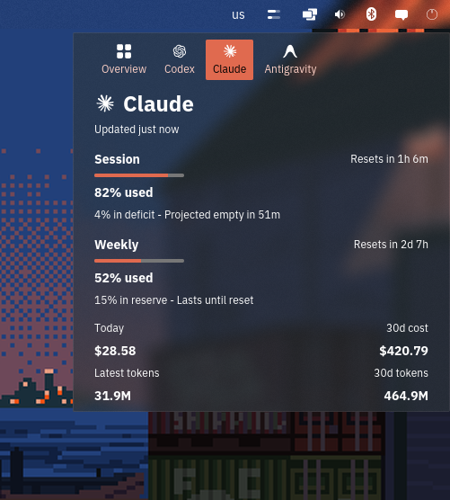

# codexbar-cosmic-applet

A native [COSMIC](https://github.com/pop-os/cosmic-epoch) panel applet that shows
your agent usage limits, in the spirit of the macOS app
[CodexBar](https://github.com/steipete/CodexBar).



Every provider CodexBar itself supports works here too - this reads whatever
`codexbar usage`/`codexbar cost` report. It also ships icons for CodexBar's 
full provider list (OpenAI, Claude,Gemini, Copilot, Cursor, Mistral, DeepSeek, 
Grok, etc.).

The applet adds a small icon to the COSMIC panel. Clicking it opens a popup with
a tab per provider - each showing that provider's logo over its name - plus an
**Overview** tab that condenses every provider to one line. The tab strip
scrolls horizontally, so any number of providers fits. A provider's own tab
shows:

- the provider label, account, snapshot age and plan,
- session / weekly / monthly usage as a percentage plus a progress bar,
- when each limit window resets,
- CodexBar's pace projection ("On pace", "Projected empty in 3h 50m"),
- today's and the last 30 days' cost and token counts,
- redeemable limit-reset credit,
- remaining credits, when the provider reports them.

The popup body scrolls, so extra providers or windows never push content out of
view. State is refreshed every 60 seconds, and again whenever the popup is
opened.

## How it works

The applet does not talk to any provider itself. It shells out to the `codexbar`
CLI that ships with CodexBar:

```sh
codexbar usage --format json
codexbar cost --format json --days 30
```

and renders the resulting JSON. If the CLI is missing, fails, or reports an error
for a provider, the popup shows that error instead of going blank. Only Codex and
Claude appear in the `cost` output; providers missing from it simply have no cost
block. A failing `cost` call never blanks the usage display.

## Prerequisites

- The COSMIC desktop (this is a `cosmic-panel` applet; it does not run under
  GNOME, KDE, or Cinnamon).
- A Rust toolchain and [`just`](https://github.com/casey/just), installed via
  your distribution's package manager (or `cargo install just`).
- The `codexbar` CLI, installed separately from
  [steipete/CodexBar](https://github.com/steipete/CodexBar) (Homebrew, the AUR, or
  a release tarball). The applet looks for `codexbar` on `PATH` first, then
  falls back to `~/.local/bin`, `/home/linuxbrew/.linuxbrew/bin` and
  `~/.linuxbrew/bin` - panel applets are started by the graphical session,
  which does not source your shell profile, so a `PATH` set up there is not
  visible to the applet.
- At least one provider enabled in CodexBar, e.g.:

  ```sh
  codexbar config enable --provider codex
  codexbar config enable --provider claude
  ```

## Build and install

```sh
git clone https://github.com/andrew-verde/codexbar-cosmic-applet.git
cd codexbar-cosmic-applet
just build-release
sudo just install
```

`just install` places:

| file | destination |
| --- | --- |
| `codexbar-cosmic-applet` | `/usr/bin/` |
| `io.github.andrew_verde.codexbar-cosmic-applet.desktop` | `/usr/share/applications/` |
| `io.github.andrew_verde.codexbar-cosmic-applet-symbolic.svg` | `/usr/share/icons/hicolor/scalable/apps/` |
| `io.github.andrew_verde.codexbar-cosmic-applet.svg` | `/usr/share/icons/hicolor/scalable/apps/` |
| `io.github.andrew_verde.codexbar-cosmic-applet.metainfo.xml` | `/usr/share/metainfo/` |

To install somewhere else, override `prefix` or `rootdir`, e.g.
`just prefix=$HOME/.local install` (COSMIC also reads applets from
`~/.local/share/applications`).

Remove it again with `sudo just uninstall`. Run the unit tests with `just test`.

### Flatpak

`flatpak/io.github.andrew_verde.codexbar-cosmic-applet.json` builds the applet as
a Flatpak:

```sh
flatpak install flathub org.flatpak.Builder
flatpak install flathub com.system76.Cosmic.BaseApp//stable \
    org.freedesktop.Sdk//25.08 org.freedesktop.Sdk.Extension.rust-stable//25.08

cd flatpak
flatpak run --filesystem=host --share=network \
    --env=FLATPAK_USER_DIR="$HOME/.local/share/flatpak" \
    --command=flatpak-builder org.flatpak.Builder \
    --user --force-clean --install \
    build io.github.andrew_verde.codexbar-cosmic-applet.json
```

`FLATPAK_USER_DIR` is needed because `org.flatpak.Builder` redirects
`XDG_DATA_HOME` into its own per-app data directory, so without it the builder
cannot see the `com.system76.Cosmic.BaseApp` the manifest builds on and fails
with "not installed" even when it is.

`flatpak/cargo-sources.json` pins every crate for the offline build inside the
sandbox; regenerate it whenever `Cargo.lock` changes:

```sh
flatpak run --filesystem=host --command=flatpak-cargo-generator \
    org.flatpak.Builder Cargo.lock -o flatpak/cargo-sources.json
```

`codexbar` itself still has to be installed on the host, not in the sandbox -
it holds your provider credentials in `~/.codex`, `~/.claude` and the like. The
sandboxed applet runs it through `flatpak-spawn --host`, and reads its own
config from the host's `~/.config/codexbar-cosmic-applet/config.toml` rather
than the per-app directory Flatpak would otherwise point it at.

## Adding it to the panel

1. Open **Settings → Desktop → Panel** (or **Dock**).
2. Choose **Configure panel applets**.
3. Find **CodexBar** in the list and add it to whichever section you prefer.

You may need to log out and back in (or restart `cosmic-panel`) before a
newly installed applet appears in that list.

If you are upgrading from a version before the applet ID changed from
`io.github.andrew-verde.*` to `io.github.andrew_verde.*` (a hyphen is not
legal in that position in a Flatpak ID), the panel still refers to the old ID.
Remove the applet in **Settings → Desktop → Panel** and add it again.

## Configuration

The applet reads an optional TOML file from

```
~/.config/codexbar-cosmic-applet/config.toml
```

(strictly `$XDG_CONFIG_HOME/codexbar-cosmic-applet/config.toml`). A commented
copy is written out the first time the applet runs, and re-read on every
refresh — edits apply within about 60 seconds, with no need to restart the
applet or the panel. If the file is missing or malformed the applet falls back
to the defaults; a parse error is shown as a caption at the bottom of the popup
rather than being swallowed.

| field | type | default | effect |
| --- | --- | --- | --- |
| `show_session` | bool | `true` | Show the shortest rolling window (`usage.primary`). |
| `show_weekly` | bool | `true` | Show the second window (`usage.secondary`), normally weekly. |
| `show_monthly` | bool | `true` | Show the third window (`usage.tertiary`), normally monthly. |
| `show_reset_countdown` | bool | `true` | Show the "Resets in 2h 30m" text beside each visible window's title. When `false` the percentage and progress bar remain. |
| `show_pace` | bool | `true` | Show CodexBar's pace projection under each visible window, e.g. "31% in reserve - Lasts until reset". Providers that report no projection are unaffected. |
| `show_cost` | bool | `true` | Show the cost / token block ("Today", "30d cost", "Latest tokens", "30d tokens"). Only Codex and Claude report cost data; other providers omit the block. |
| `show_reset_credits` | bool | `true` | Show the "Limit reset credits: N available" line — the periodic grants that let a Codex account reset its weekly window early. Hidden whenever nothing is redeemable, which is most of the time. |
| `show_credits` | bool | `true` | Show the remaining-credits line for providers that report credits. |
| `show_account` | bool | `true` | Show the account (usually an email address) beside the provider name. |
| `usage_display` | string | `"used"` | `"used"` reports quota consumed, `"remaining"` reports quota left (percentages and bars are inverted). Each line names the mode, e.g. "20% used". An unrecognised value falls back to `"used"`. |
| `background_opacity` | float | *unset* (commented out in the generated file) | Alpha of the popup background, from `0.0` (fully transparent) to `1.0` (solid). Leave it out to follow the COSMIC theme, which is what makes the popup look like every other panel popup — translucent when "frosted applets" is on so the compositor blurs behind it, opaque when it is off. Setting a value overrides the theme outright; use `1.0` if a translucent popup is hard to read over a busy wallpaper. Out-of-range values are clamped. |

Unknown keys are ignored and omitted keys keep their default, so the defaults
above are also exactly the behaviour with no config file at all.

## Provider icons

Every provider CodexBar reports gets a tab automatically — the applet has no
hardcoded provider list. The brand logos are the one part that does not follow
along on its own: they are byte-for-byte copies of CodexBar's own
`ProviderIcon-<slug>.svg` files, vendored into `data/icons/providers/` and
embedded in the binary. A provider with no vendored icon still gets its tab,
just with a text-only label.

[`tools/update-icons.py`](tools/update-icons.py) keeps that snapshot current: it
re-vendors from upstream and regenerates the lookup table in
[`src/icons.rs`](src/icons.rs), sorted, which is what the binary search there
needs. Run it any time with:

```sh
just update-icons
```

[`.github/workflows/update-icons.yml`](.github/workflows/update-icons.yml) runs
the same script every Monday and opens a pull request when anything changed.

## JSON schema notes

The parser in [`src/codexbar.rs`](src/codexbar.rs) targets the shape documented in
CodexBar's `docs/cli.md` and defined by `ProviderPayload` in
`Sources/CodexBarCLI/CLIPayloads.swift`: `codexbar usage --format json` emits a
JSON **array** of provider payloads, encoded by Swift's `JSONEncoder` with
lowerCamelCase keys and ISO 8601 dates.

Only the fields this applet displays are decoded — `provider`, `account`,
`version`, `source`, `usage.{primary,secondary,tertiary}.{usedPercent,
windowMinutes,resetsAt,resetDescription}`, `usage.updatedAt`,
`usage.identity.{loginMethod,accountEmail}`,
`usage.codexResetCredits.credits[].{status,
expires_at}`, `pace.{primary,secondary,tertiary}`, `credits.remaining` and
`error.message`. The account shown beside the provider name comes from
`usage.identity.accountEmail`; the top-level `account` that `docs/cli.md`
documents is not emitted by the CLI in practice and is only a fallback. From
`codexbar cost` it reads
`provider`, `currencyCode`, `sessionCostUSD`, `sessionTokens`,
`last30DaysCostUSD` and `last30DaysTokens`. Everything is optional and unknown
keys are ignored, so a CodexBar release that adds or renames fields degrades
gracefully rather than breaking the applet.

Several pieces of presentation are *not* in the JSON and are computed here:

- **Provider labels.** The payload carries only the provider id, so `codex` and
  `claude` are mapped to "Codex" and "Claude" and anything else is capitalised.
- **Window names.** "Session" / "Weekly" / "Monthly" are derived from
  `windowMinutes` (`<= 300`, `10080`, `43200`); other values are rendered
  generically, and a missing `windowMinutes` falls back to the name of the slot
  the window came from.
- **Reset text.** A countdown computed from `resetsAt` is preferred over
  `resetDescription`, which is a localised wall-clock string ("Resets 3:50pm
  (Asia/Tokyo)") that is both wider than the popup's value column and less
  useful than the time remaining. The description is only used when there is no
  `resetsAt`, with its parenthesised timezone dropped.
- **Token counts.** Abbreviated, e.g. `19523312` becomes `19.5M`.
- **Redeemable reset credits.** `usage.codexResetCredits` is undocumented in
  CodexBar's `docs/cli.md`; its shape is taken from CodexBar's Swift source and
  the live payload, and its keys are snake_case where the rest of the payload is
  camelCase. The count comes from filtering `credits` for `status ==
  "available"` that have not lapsed, as the macOS app does, rather than from the
  `availableCount` beside them.

## License

MIT - see [LICENSE](LICENSE).

The provider icons under `data/icons/providers/` are vendored unmodified from
[CodexBar](https://github.com/steipete/CodexBar) (MIT, Copyright (c) 2026 Peter
Steinberger) and embedded into the binary at compile time. See
[THIRD_PARTY_LICENSES.md](THIRD_PARTY_LICENSES.md) for the full license text.

One function in `src/window.rs` derives from
[libcosmic](https://github.com/pop-os/libcosmic) and is MPL-2.0 rather than MIT;
it is identified in both the source and `THIRD_PARTY_LICENSES.md`.

The Overview tab's icon is original artwork bundled with the applet, so it looks
the same under every icon theme.
