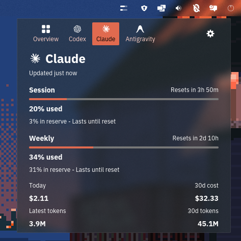
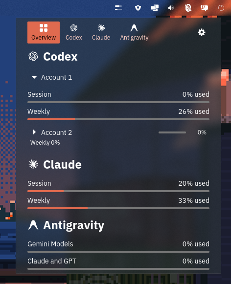

# cosmic-ext-applet-codexbar

A COSMIC panel applet that displays usage limits reported by the [CodexBar CLI](https://github.com/steipete/CodexBar). Each provider gets a tab. The Overview tab summarizes providers. A provider with several accounts lists each as a row you can expand. The applet refreshes every 60 seconds and when its popup opens.

This is a third-party project. It is not official COSMIC software and is not endorsed by System76. See the [trademark notice](docs/install.md#trademarks) and [license information](docs/install.md#license).





Install the COSMIC desktop, Rust, `just`, and the CodexBar CLI. Follow the [build and installation guide](docs/install.md). See [account and display settings](docs/configuration.md) to configure the applet.

## Configuration

Edit `~/.config/cosmic-ext-applet-codexbar/config.toml`. To hide account email captions while recording or streaming:

```toml
show_account = false
```

The applet reloads the file when the popup opens and every 60 seconds. All settings are optional.

| Setting | Default | Effect |
| --- | --- | --- |
| `show_account` | `true` | Set to `false` to hide account emails in Overview and provider tabs. Unnamed accounts become "Account 1", "Account 2", and so on. |
| `account_labels` | `{}` | Name account rows by mapping a CLI email or account label to a name, such as `{ "personal@example.com" = "Personal" }`. Names remain visible when email captions are hidden. |
| `usage_display` | `"used"` | Show quota consumed with `"used"` or quota left with `"remaining"`. |
| `show_session` | `true` | Show the shortest usage window. |
| `show_weekly` | `true` | Show the second usage window, normally weekly. |
| `show_monthly` | `true` | Show the third usage window, normally monthly. |
| `show_reset_countdown` | `true` | Show the time until each window resets. |
| `show_pace` | `true` | Show pace projections when reported. |
| `show_cost` | `true` | Show local cost and token counts when reported. |
| `show_reset_credits` | `true` | Show available Codex limit-reset credits. |
| `show_credits` | `true` | Show remaining provider credits. |
| `background_opacity` | Unset | Follow the COSMIC theme, or set a value from `0.0` to `1.0` to override popup opacity. |

Email hiding applies to account captions. Custom labels and provider messages or detail rows can still contain personal information. See the [configuration guide](docs/configuration.md) for file paths, defaults, and multiple-account setup.

## Documentation

- [Installation and panel setup](docs/install.md)
- [Configuration and multiple accounts](docs/configuration.md)
- [CLI integration and data format](docs/data-format.md)
- [Development](docs/development.md)
- [Third-party licenses](THIRD_PARTY_LICENSES.md)
